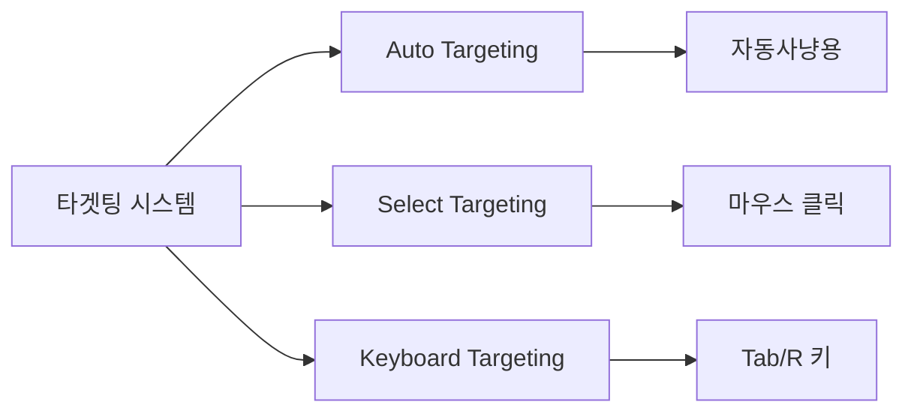
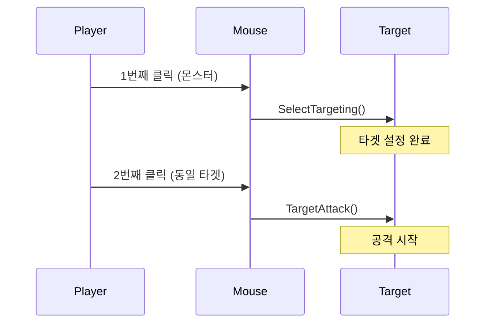
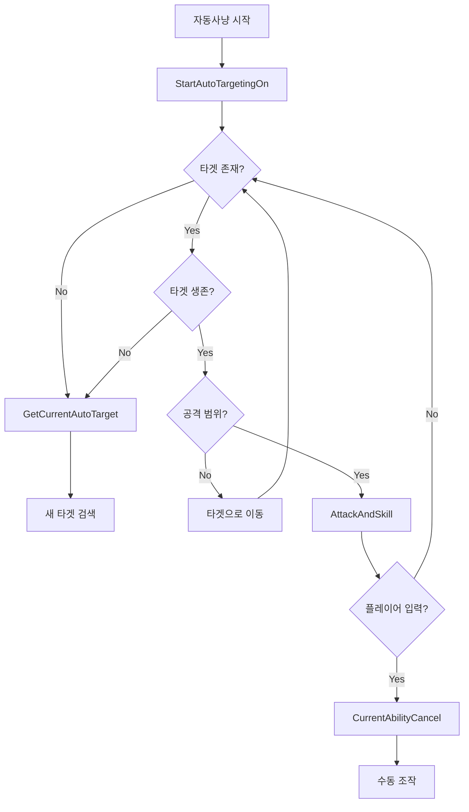
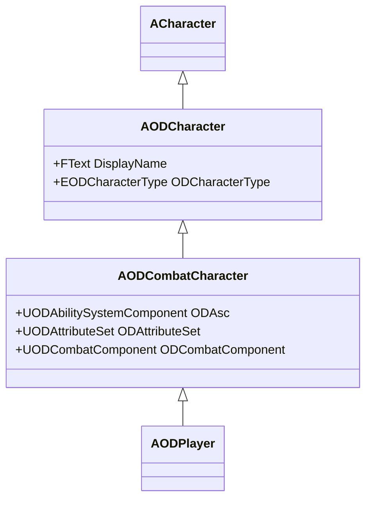
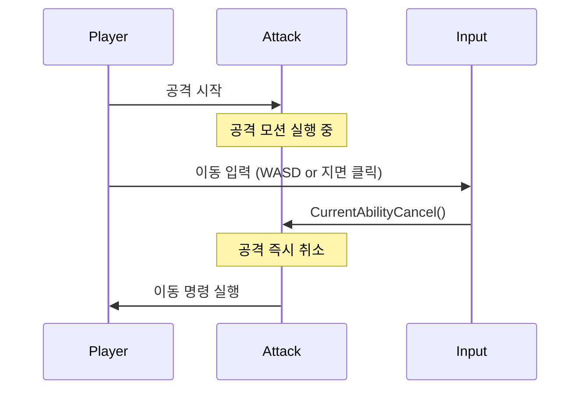
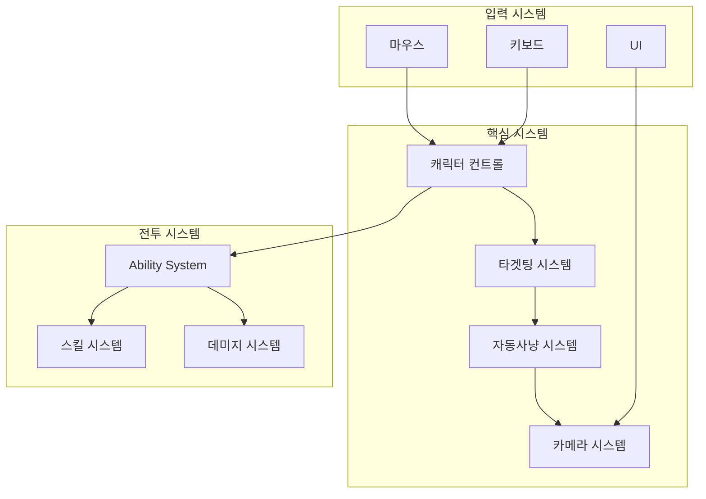

%%{init: {
  "theme": "base",
  "themeVariables": {
    "background": "transparent",
    "primaryColor": "#ffffff",
    "primaryTextColor": "#000000",
    "primaryBorderColor": "#000000",
    "lineColor": "#000000",
    "secondaryColor": "#ffffff",
    "tertiaryColor": "#ffffff",
    "fontFamily": "Pretendard, Noto Sans KR, Arial",
    "fontSize": "16px"
  },
  "flowchart": {
    "curve": "linear",
    "nodeSpacing": 40,
    "rankSpacing": 50
  }
}}%%

flowchart TD
  START([게임 시작]) --> INIT([초기화])
  INIT --> HASCHAR{캐릭터 존재?}

  HASCHAR -->|No| CREATE([캐릭터 생성])
  HASCHAR -->|Yes| SELECT([캐릭터 선택])

  CREATE --> FIELD([필드 진입])
  SELECT --> FIELD

  FIELD --> ACTION{플레이어 행동?}

  ACTION -->|자동사냥| AUTO([자동사냥])
  ACTION -->|수동 플레이| MANUAL([수동 플레이])
  ACTION -->|던전 입장| DENTER([던전 입장])

  DENTER --> DPLAY([던전 플레이])
  DPLAY --> DRESULT{던전 결과?}
  DRESULT -->|클리어| CLEAR([클리어])
  DRESULT -->|실패| FAIL([실패])

  AUTO --> END([게임 종료])
  MANUAL --> END
  CLEAR --> END
  FAIL --> FIELD

  %% ---------- 스타일(흑백 플로우차트 느낌) ----------
  classDef box fill:#ffffff,stroke:#000000,stroke-width:2px,color:#000000;
  classDef decision fill:#ffffff,stroke:#000000,stroke-width:2px,color:#000000;
  classDef end fill:#ffffff,stroke:#000000,stroke-width:2px,color:#000000;

  class START,INIT,CREATE,SELECT,FIELD,AUTO,MANUAL,DENTER,DPLAY,CLEAR,FAIL box;
  class HASCHAR,ACTION,DRESULT decision;
  class END end;

  linkStyle default stroke:#000000,stroke-width:2px;

# OD 게임 시스템 문서

이 문서는 OD 프로젝트의 핵심 게임플레이 시스템에 대한 기술 문서입니다.

## 목차

1. [카메라 시스템](#1-카메라-시스템)
2. [타겟팅 시스템](#2-타겟팅-시스템)
3. [자동사냥 시스템](#3-자동사냥-시스템)
4. [캐릭터 컨트롤 시스템](#4-캐릭터-컨트롤-시스템)
5. [통합 시스템 개요](#5-통합-시스템-개요)

---

## 1. 카메라 시스템

### 개요
`ODCameraControllerComponent`는 3가지 카메라 모드를 제공하며, 자연스러운 전환과 자동사냥 중 카메라 추적 기능을 지원합니다.

### 1.1 카메라 모드 (ECamMode)

| 모드 | 용도 | 특징 |
|------|------|------|
| **Q** | 근접 전투 | 가까운 시점, 자동사냥 시 카메라 고정 |
| **N** | 일반/기본 | 중간 시점, 자동사냥 시 캐릭터 뒤 추적 |
| **D** | 원거리/전술 | 먼 시점, 자동사냥 시 캐릭터 뒤 추적 |

### 1.2 카메라 프리셋 구조 (FCamPreset)

```cpp
struct FCamPreset
{
    float ArmLength;      // SpringArm 길이
    float FOV;            // 시야각
    FRotator ArmRot;      // SpringArm 회전
    FVector Offset;       // 카메라 오프셋
    float ZoomSpeed;      // 줌 속도
    float ArmMin, ArmMax; // 줌 범위
    float PitchMin, PitchMax; // 피치 제한
};
```

### 1.3 카메라 전환 메커니즘

#### UI 기반 전환
- `ODWidget_CameraButton`을 통한 모드 전환
- `UseQ()`, `UseN()`, `UseD()` 함수가 UI 버튼 클릭 시 호출
- `NextPreset()`: 순환 전환 (Q → N → D → Q)

#### 자연스러운 보간
```cpp
// Lerp 기반 부드러운 전환
InterpSpeed = 1.0f;  // 보간 속도
```

### 1.4 자동사냥 중 카메라 동작


https://github.com/user-attachments/assets/b2c80920-2ae7-4bf9-b077-15cdf0397aff


> [!IMPORTANT]
> **N/D 모드 전용**: 자동사냥 시 N 또는 D 카메라 모드일 때만 캐릭터 뒤로 자동 회전합니다.
> **Q 모드**: 근접 전투용 고정 시점을 유지하여 자동 추적이 비활성화됩니다.

#### 핵심 함수
- `StartLerpToNDPreset()`: N/D 모드일 때 자동 추적 활성화
- `StopLerpToNDPreset()`: 자동 추적 비활성화
- `UpdateCameraLerp()`: 캐릭터 뒤쪽으로 카메라 Yaw 자동 회전

#### 파라미터
```cpp
float AutoHuntYawInterpSpeed = 1.0f;  // 자동사냥 중 Yaw 회전 속도
float LerpDuration = 2.0f;             // 보간 시간
float YawSyncDelay = 2.0f;             // 마우스 룩 비활성화 후 자동 회전 딜레이
```

### 1.5 입력 처리

#### 마우스 입력
- `HandleLook()`: 마우스 룩 입력 처리
- `SetMouseLookActive()`: 마우스 룩 모드 활성화/비활성화
- `MouseRotationInterpSpeed = 10.0f`: 마우스 회전 보간 속도

#### 키보드 입력
- `UpdateFromMoveAxis()`: 이동 입력에 따른 카메라 자동 회전
- `AutoYawMaxDegPerSec = 10.0f`: 키보드 입력 시 자동 회전 속도
- `DeadzoneDeg = 2.0f`: 데드존 각도

#### 줌 컨트롤
- `SetZoomAxis(float AxisValue)`: 마우스 휠 줌 인/아웃

---

## 2. 타겟팅 시스템

### 개요
3가지 독립적인 타겟팅 방식을 제공하여 다양한 플레이 스타일을 지원합니다.

### 2.1 타겟팅 시스템 비교



### 2.2 Auto Targeting (자동 타겟팅)

**목적**: 자동사냥 시 가장 가까운 적을 자동으로 타겟팅

#### 구현 구조
```cpp
class UODTargetComponent
{
    USphereComponent* AutoTargetCollision;  // 범위 감지
    TSet<AODCombatCharacter*> AutoTargetArray;  // 범위 내 적 목록
    AODCombatCharacter* CurrentAutoTarget;  // 현재 자동 타겟
};
```

#### 동작 흐름
1. `AutoTargetCollision` (Sphere)가 범위 내 적 감지
2. `OnAutoTargetCollisionBeginOverlap()`: 진입 시 `AutoTargetArray`에 추가
3. `OnAutoTargetCollisionEndOverlap()`: 이탈 시 제거
4. `SetAutoTarget()`: 타이머 기반으로 가장 가까운 적 선택
5. `CurrentAutoTarget`에 저장

#### 제어 함수
- `StartAutoTargeting()`: 자동 타겟팅 시작
- `StopAutoTargeting()`: 자동 타겟팅 종료

### 2.3 Select Targeting (선택 타겟팅)

**목적**: 마우스 클릭으로 직접 타겟 선택 및 공격

#### 2단계 클릭 시스템



#### 구현
```cpp
// 1번째 클릭: 타겟 설정
void SelectTargeting(AODCombatCharacter* InTarget);

// 2번째 클릭: 타겟 공격
void TargetAttack();

// 네트워크 동기화
UPROPERTY(Replicated)
AODCombatCharacter* CurrentSelectTarget;

UFUNCTION(Server, Reliable)
void ServerSetSelectTarget(AODCombatCharacter* NewTarget);
```

#### 마우스 입력 처리

**클릭 타입 구분**:

| 클릭 타입 | 조건 | 동작 |
|-----------|------|------|
| **짧은 클릭** | `< ShortPressThreshold` | 대상 타입 판별 |
| **길게 누르기** | `>= ShortPressThreshold` | 카메라 회전 |

**대상 타입별 처리**:
- **땅 클릭**: `TileClick()` - 이동
- **UI 클릭**: UI 상호작용
- **몬스터 클릭**: 타겟 설정 또는 공격
- **캐릭터 클릭**: 상호작용

```cpp
bool MouseButtonHeld = false;
FTimerHandle MouseHoldTime;
float ShortPressThreshold = 0.2f;  // 짧은 클릭 임계값
```

### 2.4 Keyboard Targeting (키보드 타겟팅)

**목적**: 키보드로 주변 적들을 순환하며 타겟팅

#### Tab 키 - 소프트 타겟팅
```cpp
void KeyboardTargeting()  // Tab 키 입력
{
    SoftTargeting();  // 다음 타겟으로 순환
}

TArray<AODCombatCharacter*> SoftTargetArray;  // 순환 타겟 목록
```

#### R 키 - 범위 감지
```cpp
void DetectTargeting()  // R 키 입력
{
    DetectTargetArray = DetectInRange(DetectRange);  // 범위 내 모든 적 감지
}

void DetectTargetArrayClear();  // 감지 목록 초기화
```

### 2.5 타겟 시각화

#### 아웃라인 효과
```cpp
// Auto Target 아웃라인
void OnAutoTargeted();
void OnAutoTargetCleared();

// Select Target 아웃라인
void OnSelectTargeted();
void OnSelectTargetCleared();
```

---

## 3. 자동사냥 시스템

### 개요
자동으로 타겟을 찾아 추적하고 공격하는 시스템입니다.

### 3.1 자동사냥 흐름도



### 3.2 활성화/비활성화

```cpp
void StartAutoTargetingOn()
{
    IsAutoHuntActive = true;
    // AutoHuntLoopTimer 시작
    // 카메라 컨트롤러에 알림
    CameraControllerComponent->SetAutoHuntActive(true);
}

void StopAutoTargetingOff()
{
    IsAutoHuntActive = false;
    // 타이머 정리
    CameraControllerComponent->SetAutoHuntActive(false);
}
```

### 3.3 자동사냥 루프

```cpp
void AutoHuntLoop()
{
    // 1. 타겟 검색
    CurrentAutoTarget = TargetComponent->GetCurrentAutoTarget();
    
    if (!CurrentAutoTarget || IsDead(CurrentAutoTarget))
    {
        // 새로운 타겟 검색
        TargetComponent->GetAutoTarget();
        return;
    }
    
    // 2. 타겟 추적
    IsTargetTracking = true;
    MoveToTarget(CurrentAutoTarget);
    
    // 3. 공격 범위 확인 및 공격
    if (IsInAttackRange(CurrentAutoTarget))
    {
        AttackAndSkill();
    }
}
```

### 3.4 공격 및 스킬 실행

```cpp
UFUNCTION(Server, Reliable)
void AttackAndSkill()
{
    // Ability System을 통한 공격/스킬 실행
    if (ODAsc)
    {
        // 스킬 쿨다운 확인
        // 사용 가능한 스킬 선택
        // 우선순위: 스킬 > 기본 공격
        ODAsc->TryActivateAbility(...);
    }
}
```

### 3.5 공격 취소 및 입력 우선순위

> [!IMPORTANT]
> **플레이어 입력 최우선**: 자동사냥 중에도 플레이어의 키보드/마우스 입력이 감지되면 즉시 공격을 취소하고 수동 조작으로 전환됩니다.

#### 구현
```cpp
void CurrentAbilityCancel()
{
    // 현재 실행 중인 공격/스킬 어빌리티 즉시 취소
    if (ODAsc && ODAsc->IsActivating())
    {
        ODAsc->CancelAbility(...);
    }
}

bool IsCurrentAbilityCancel()
{
    // 어빌리티 취소 가능 여부 확인
}
```

#### 취소 트리거
1. **키보드 이동 입력** (WASD): 공격 모션 중 이동 키 입력 시 즉시 취소
2. **마우스 지면 클릭**: 공격 중 땅을 클릭하면 이동 명령 우선

### 3.6 네트워크 동기화

```cpp
// 타겟 검증
UFUNCTION(Server, Reliable)
void Server_CheckTarget(AODCombatCharacter* TargetToCheck);

// 타겟 재검색 지시
UFUNCTION(Client, Reliable)
void Client_ForceTargetResetAndSearch();

// 이동 정지
UFUNCTION(NetMulticast, Reliable)
void Multicast_StopMovementOnTargetDead();
```

---

## 4. 캐릭터 컨트롤 시스템

### 4.1 캐릭터 계층 구조



### 4.2 캐릭터 타입

```cpp
enum class EODCharacterType
{
    None,
    Player,
    FieldGruntMonster,
    FieldBossMonster,
    DungeonGruntMonster,
    DungeonBossMonster
};
```

### 4.3 이동 입력 처리

#### 키보드 이동 (WASD)
- Enhanced Input System 사용
- `UpdateFromMoveAxis()`: 이동 축 값을 카메라 컨트롤러에 전달
- 카메라 방향 기준 이동

#### 마우스 클릭 이동
```cpp
void TileClick()
{
    // 지면 클릭 시 해당 위치로 이동
    CachedDestination = ClickedLocation;
    IsMovingClick = true;
    // Navigation System을 통한 경로 찾기
}
```

### 4.4 전투 입력 처리

#### F 키 - 타겟 공격
```cpp
void TargetAttack()
{
    // 현재 타겟 공격
    // 타겟이 없으면 자동으로 가장 가까운 적 타겟팅
}
```

#### 마우스 클릭 공격
- **1번째 클릭**: 타겟 설정
- **2번째 클릭**: 타겟 공격

#### 공격 중 입력 우선순위



> [!NOTE]
> 자동사냥 중에도 동일하게 적용되어 플레이어 입력이 항상 최우선으로 처리됩니다.

### 4.5 스킬 입력

```cpp
// 스킬 슬롯 (1~8번 키)
bool TryActiveSkill(const uint32& SlotIndex)
{
    // 스킬 쿨다운 확인
    // 스킬 활성화 시도
}
```

### 4.6 카메라 컨트롤 입력

| 입력 | 동작 |
|------|------|
| **UI 버튼 클릭** | Q, N, D 카메라 프리셋 전환 |
| **마우스 길게 누르기** | 카메라 회전 (드래그) |
| **마우스 휠** | 줌 인/아웃 |

```cpp
void SetMouseLookActive(bool bActive)
{
    bMouseLookActive = bActive;
    if (bActive)
    {
        // 마우스 룩 모드 활성화
        HandleLook();
    }
}
```

### 4.7 입력 방지 메커니즘

```cpp
float LastClickTime = 0.f;
float MinClickInterval = 0.2f;  // 연속 클릭 방지

// 클릭 간격 확인
if (CurrentTime - LastClickTime < MinClickInterval)
{
    return;  // 너무 빠른 클릭 무시
}
```

---

## 5. 통합 시스템 개요

### 5.1 시스템 간 상호작용



### 5.2 Gameplay Ability System (GAS) 통합

#### 핵심 컴포넌트
```cpp
class AODCombatCharacter
{
    UODAbilitySystemComponent* ODAsc;  // 어빌리티 관리
    UODAttributeSet* ODAttributeSet;   // 캐릭터 스탯
    UODCombatComponent* ODCombatComponent;  // 전투 로직
};
```

#### 공격 어빌리티
- `OD_GA_Combat_NormalAttack`: 기본 공격
- `OD_GA_Combat_RangedAttack`: 원거리 공격
- `OD_GA_Boss_DashAttack`: 보스 대시 공격

#### 스킬 어빌리티
- `OD_GA_Skill_Base`: 스킬 베이스 클래스
- `OD_GE_Skill_Cooldown`: 스킬 쿨다운 효과
- `OD_GE_Skill_Cost`: 스킬 비용 효과

### 5.3 스킬 시스템

#### 스킬 슬롯 구조
```cpp
struct FSkillSlot
{
    FGameplayTag SkillTag;           // 스킬 태그
    UPaperSprite* SkillIcon;         // 스킬 아이콘
    FActiveGameplayEffectHandle CooldownHandle;  // 쿨다운 관리
    FSkillCooldownDuration CooldownDuration;     // 쿨타임 정보
    
    FWidgetCooldownDele WidgetCooldownDele;  // UI 바인딩
};
```

#### 스킬 관리
```cpp
class UODSkillComponent
{
    // 스킬 배우기
    UFUNCTION(Server, Reliable)
    void UnlockSkill(const FGameplayTag& InTag);
    
    // 스킬 슬롯 등록
    void AddSkillToSlot(const uint32& InIndex, const FGameplayTag& InTag);
    
    // 스킬 사용
    bool TryActiveSkill(const uint32& SlotIndex);
};
```

### 5.4 네트워크 아키텍처

#### Replication 패턴
```cpp
// Replicated 속성
UPROPERTY(Replicated)
AActor* CurrentTarget;

UPROPERTY(Replicated)
bool IsTargetTracking;

// Server RPC
UFUNCTION(Server, Reliable)
void Server_SetNewTarget(AODCombatCharacter* Target);

// Client RPC
UFUNCTION(Client, Reliable)
void Client_ForceTargetResetAndSearch();

// Multicast RPC
UFUNCTION(NetMulticast, Reliable)
void Multicast_StopMovementOnTargetDead();
```

#### Replication Graph 최적화
```cpp
interface IODRepGraphInterface
{
    int32 GetRepGraphCount();
    void SetRepGraphCount(const int32 InRepGraph);
};
```

### 5.5 AI 시스템 (몬스터)

#### Behavior Tree 태스크
- `BTS_UpdateTargetFromPerception`: 지각 기반 타겟 업데이트
- `BTTask_SelectBossTarget`: 보스 타겟 선택
- `BTTask_MoveToAttackRange`: 공격 범위로 이동
- `BTTask_PlayAttackMontage`: 공격 애니메이션 재생

#### 공격 범위 감지
- `OD_AI_AttackAreaDetector`: 공격 범위 감지기

### 5.6 UI 시스템

#### 타겟 UI
- `ODWidget_Target`: 타겟 정보 표시

#### 카메라 UI
- `ODWidget_CameraButton`: 카메라 모드 전환 버튼

#### 스킬 UI
- `ODWidget_SkillHudActive`: 스킬 HUD
- `ODWidget_SkillScreen`: 스킬 화면
- `ODWidget_SkillSlotChangeScreen`: 스킬 슬롯 변경

#### 입력 UI
- `ODWidget_Hud_UserInput`: 사용자 입력 HUD

### 5.7 데미지 시스템

```cpp
class AODCombatCharacter
{
    UFUNCTION(NetMulticast, Reliable)
    void Muliticast_AddDamage(float Damage, bool bCritical = false);
    
    UODDamageReceivedComponent* ODDamageReceivedComponent;
    UODWidget_DamageQueContainer* DamageQueContainerWidget;
};
```

---

## 기술 스택

- **엔진**: Unreal Engine (C++)
- **네트워크**: Replication, RPC (Server/Client/Multicast)
- **게임플레이**: Gameplay Ability System (GAS)
- **AI**: Behavior Tree, EQS
- **UI**: UMG (Unreal Motion Graphics)

## 주요 컴포넌트 파일

### 카메라
- [`ODCameraControllerComponent.h`](file:///c:/Users/a0104/Desktop/git/OD/Public/Components/ODCameraControllerComponent.h)
- [`ODCameraControllerComponent.cpp`](file:///c:/Users/a0104/Desktop/git/OD/Private/Components/ODCameraControllerComponent.cpp)

### 타겟팅
- [`ODTargetComponent.h`](file:///c:/Users/a0104/Desktop/git/OD/Public/Components/ODTargetComponent.h)
- [`ODTargetingAndAttackComponent.h`](file:///c:/Users/a0104/Desktop/git/OD/Public/Components/ODTargetingAndAttackComponent.h)

### 캐릭터
- [`ODCharacter.h`](file:///c:/Users/a0104/Desktop/git/OD/Public/Character/ODCharacter.h)
- [`ODCombatCharacter.h`](file:///c:/Users/a0104/Desktop/git/OD/Public/Character/ODCombatCharacter.h)

### 스킬
- [`ODSkillComponent.h`](file:///c:/Users/a0104/Desktop/git/OD/Public/Components/ODSkillComponent.h)

---
